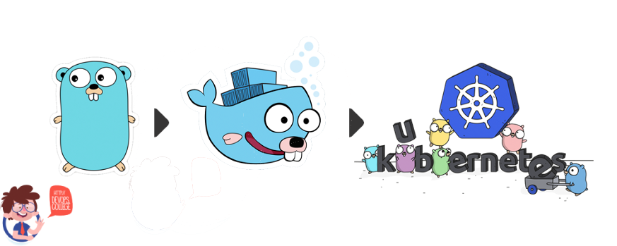

# external-sorting-on-k8s
🍵～K8S 云原生开发实践之从0到1使用 Go 语言搭建集群版外部排序

**归并排序回顾**
* 将数据分为左右两半，分别归并排序，再把两个有序数据归并
* 如何归并(这里是两路，实际用堆进行 K 路)，就是比一比大小：
  * [1, 3, 6, 7],[1, 2, 3, 5] -> 1
  * [3, 6, 7],[1, 2, 3, 5]    -> 1
  * [3, 6, 7],[2, 3, 5]       -> 2
  * [3, 6, 7],[3, 5]          -> 3
  * [6, 7], [3, 5]
  * ...
* 归并好处是它可以一个一个读，然后进行比较

### 外部排序

* 把很大的外部数据源进行切分，算一算切成几份。
* 然后每一份在一个节点里面，它有足够的内存进行内部排序。
* 各个节点排好序后，然后再给它们（N个节点）归并（K路）就好了。
  * 两路归并，节点一多，它会反复去读取外部的数据源，会造成性能上的一个浪费。
  * 在K路归并中，我们需要同时存储K个节点的最小的元素，这个存储结构叫做一个堆的存储结构。

### Pipeline，数据的一个通路

Source -> 节点 -> 节点 -> 节点 -> Sink
* 这里的节点只有一个输入输出
* 当然不一定，每个节点可以有多个输入或多个输出，也可以0个输入（Source）,0个输出（Sink）

**一些节点**
* 数组数据源节点
  * 注意⚠️： channel 的关闭及检测
* 内部排序节点
* 归并节点